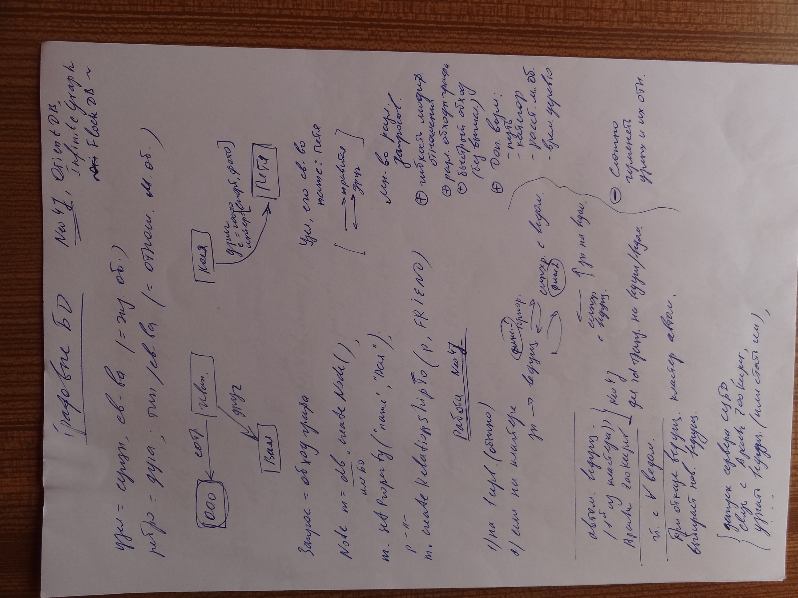
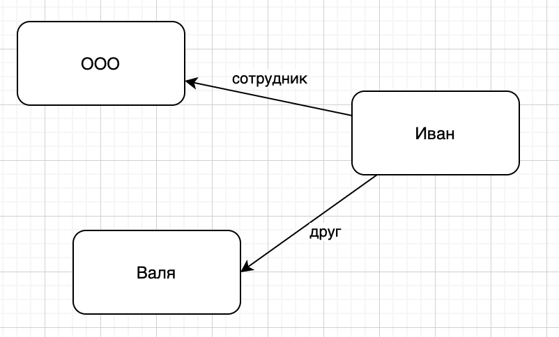
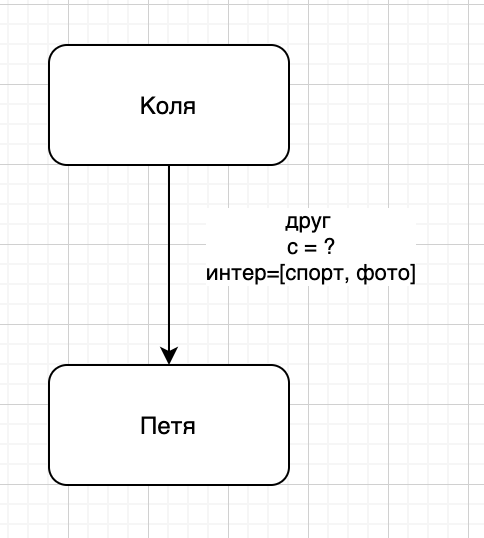
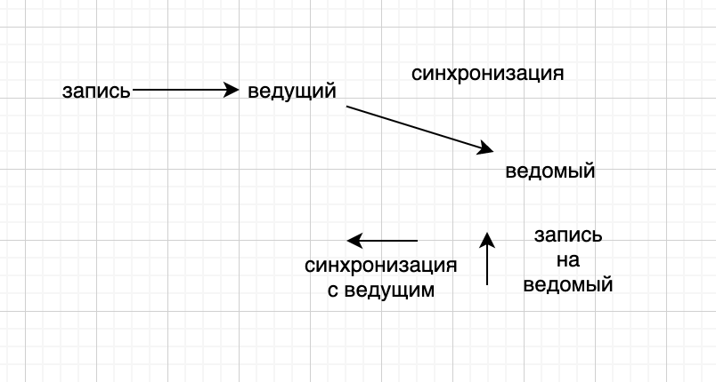
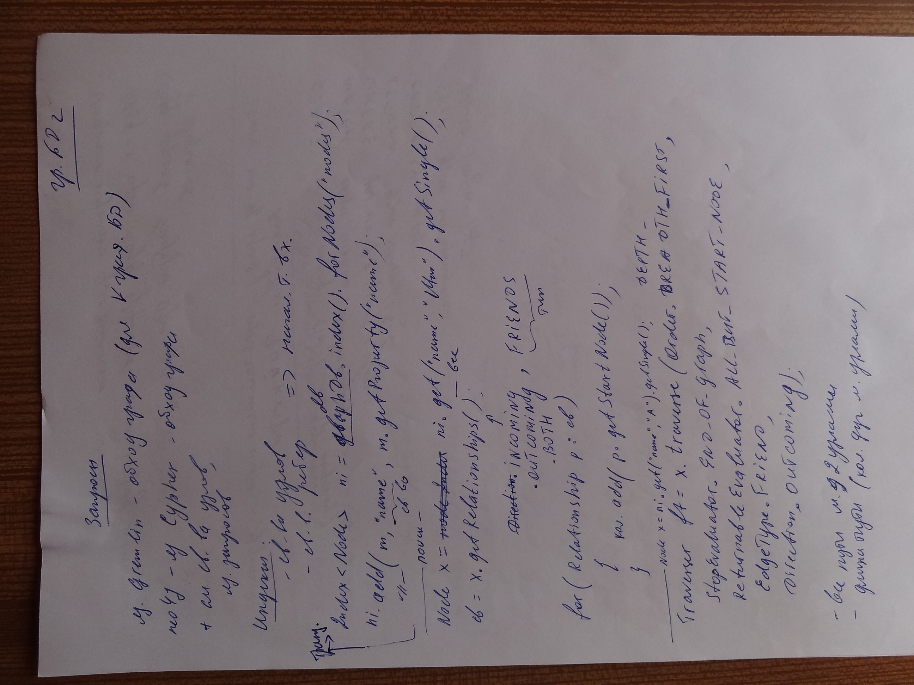
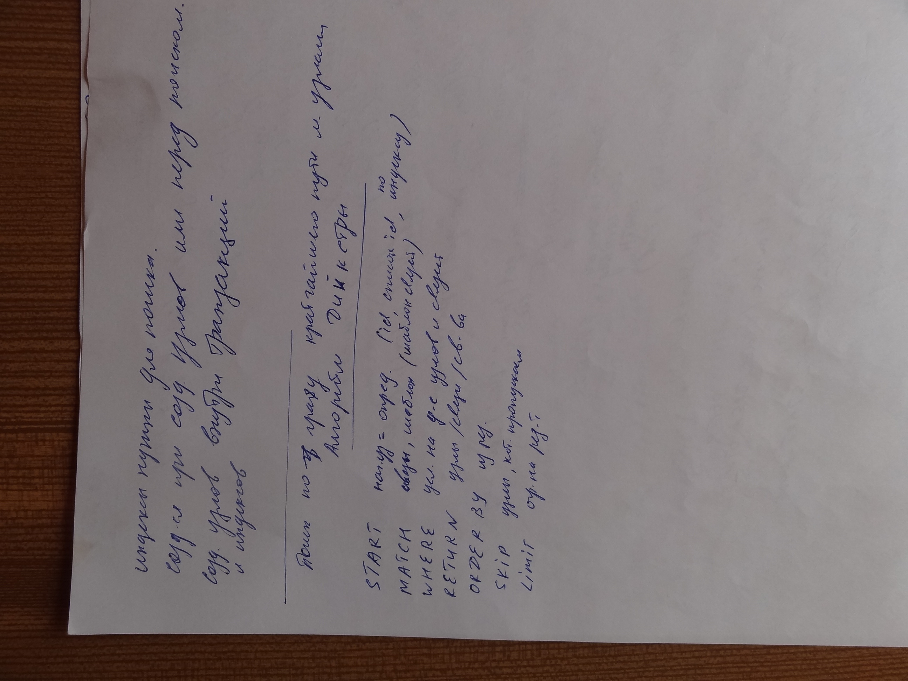
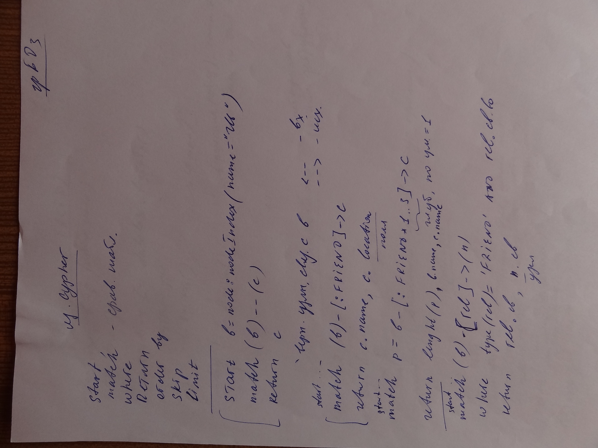
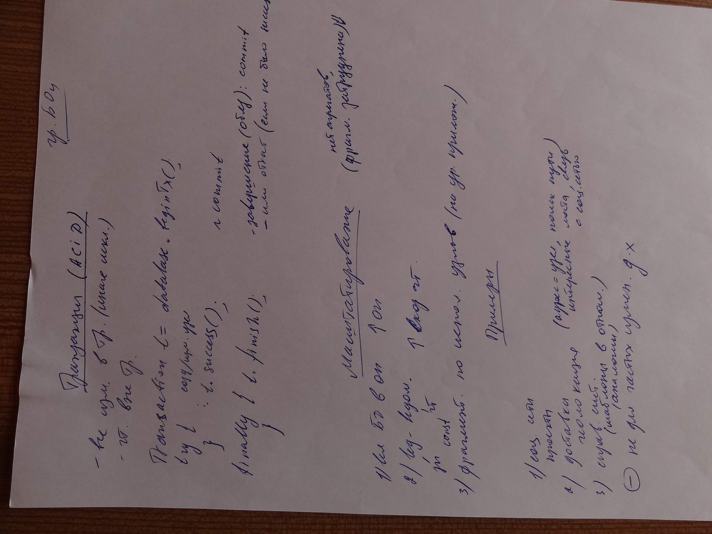

# Photo 1


## Графовые БД
Neo4j, OrientDB, InfiniteGraph, FlockDB

узел = сущность, свойства (= экземпляр объекта)
ребро = дуга; тип/свойства (= отношение между объектами)


Запрос = обход графа

```sql
Node m = db.createNode();
m.setProperty("name", "Вася");

Node p = db.createNode();
p.setProperty("name", "Валя");

m.createRelationshipTo(p, FRIEND);
```



Узел, его свойствао, name: Петя

Множество различных запросов:
- (+) гибкость модифицирования отношений
- (+) различные обходы графа
- (+) быстрый обход (без вычислений)
- (+) Дополнительные возможности (путь, категории, расстояние между объектами, временное дерево)
- (-) Сложно изменять узлы и их отношения

## Работа Neo4j
1) на 1 сервере (обычно)
2) если на кластере


Автоматический ведущий (1й из кластера), Apache ZooKeeper

При отказе ведущего кластер автоматически выбирает нового ведущего

1. Запуск сервера СУБД
2. Связь с Apache ZooKeeper
3. Узнать ведущего (или стать им)

# Photo 2


Язык Gremlin - обход графа (для любого графа БД)
neo4j - язык Cypher - обход графа   
+ см. свойства узлов, яз. запросов

Индексы
- свойства узлов
- свойства ребер

Транзакция
```sql
Index <Node> ni = graphDB.index().forNodes("nodes");
ni.add(m, "name", m.getProperty("name")); -- name - свойство
```

Поиск
```sql
Node x = ni.get("name", "Иван).getSingle();
св = x.getRelationhsips(
    -- .incoming
    .outcoming, FRIENDS -- тип
    -- .both
);

for (Relationship p:св){
    кол.add(p.getStartNode())
}
```

```sql
Traverser ft = x.traverse(
    Order.BREATH_FIRST,
    StopEvaluator.END_OF_GRPAPH,
    ReturnableEvaluator.ALL_BUT_START_NODE,
    EdgeType.FRIEND,
    Direction.OUTCOMING,
);
```
- все пути между двумя узлами
- длина пути (количество дуг между узлами)

# Photo 3

Индексы нужны для поиска
Создаются при создании узлов или перед поиском
Создание узлов внутри транзакций и индексов

## Алгоритм Дейкстры (Поиск по графу кратчайшего пути между узлами)
```
START нач. уз = опред (id, список id, по индексу)
MATCH связи, шаблон (шаблон связей)
WHERE усл на дополнение (?) узлов и связей
RETURN узлы/связи/свойства
ORDER BY из рез.
SKIP узлы, которые пропускаем
LIMIT ограничение на результат
```

# Photo 4


## Язык Cypher
- start
- match - сравнение
- where
- return
- order by
- skip
- limit

 ```sql
 start b = node:nodeIndex(name = "Иван")
 match (b) —— (c)
 return c -- вернуть узлы, связанные с b 
 ```

<-- - вх 
--> - исх

```sql
start ...
match (b) - [:FRIEND] -> c
return c.name, c.location
```

```sql
start ...
match p = b - [:FRIEND * 1..3] -> c -- 1..3 - глубина, по умолчанию = 1
return lenght(p), b.name, c.name
```

```sql
start...
match (b) - [rel] -> (n)
where type(rel) = 'FRIEND' AND rel.свойство
return rel.св, n.св
```

# Photo 5

## Транзакции (ACID)
- все изменения в транзакции (иначе искл.)
- чтение вне транзакции

```sql
Transaction t = database.beginTx();
try {
    создание/изменение узла
    t.success(); -- commit
} finally {
    t.finish(); -- завершение(обязательно): commit
                -- или откат (если не было success)
}
```

## Масштабирование
нет агрегатов (фрагментация затруднена)

1) если БД в ОП                         (увеличение ОП)
2) ведйщий(запись) - ведомый(чтений)    (увеличение скорости чтения)
3) фрагментация по сиполнения узлов     (на уровне приложения)

## Примеры
1) социальные сети, проекты
2) доставка, геолокация (адрес = узел, поиск пути, интересные места, связь с соть сетью)
3) справочные системы (шаблоны в отношении, аналогии)
\- не для частых изменений данных