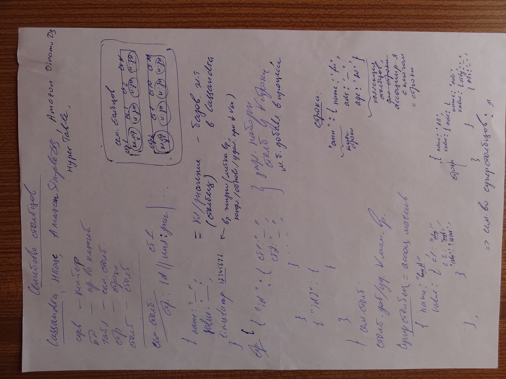

# Photo 1


Пространство ключей (аналог БД), содержится в семействе (?) стобцов для ПО

```sql
CREATE KEYSPACE ПК
use ПК
CREATE COLUMN family Pers
WITH (параметр) comparator = UTF-8 Type
    AND key_validation_class = UTF-8 Type
    AND column_metadata = [{
        column_name: fio,
        validation_class: UTF-8 Type,
        index_type: keys }, // для поиска
        {},
        {},
    }]
```

Через клиента БД:

```sql
set Pers['id']['fio'] = 'значение';

set Pers['id']['fio'] with ttl = 'N сек'; // после N сек удаляется
```

`запись данных (чтение по столбцам, а не всю строку). При записи упорядочивается по именам столбцов` (?)

```sql
get Pers['id'];

get Pers where fio = '';
```

```
del Pers['id']['fio'];
del Pers['id'];
```

```sql
create columnfamily Pers
(
    key varchar primary key,
    fio varcahr,
    ...
);

insert into Pers(key, fio, ...) values ('', '', ...);

select * from Pers where fio = '';
```

(после create index)
```sql
update Pers set age = age + 1 where key = '';
```

По умолчанию имя столбца индексируется (поиск) только по ключу строки или надо явно указать индекс, тогда вохможен поиск по `знач` индексам (битовые индексы, которые эффективны при небольшом `значении` (мб количестве) столбцов)

# Photo 2


## Семейство столбцов

Cassandra, HBase, Amazon SimpleDB, Amazon DinamoDB, HyperTable

Сервер - кластер
БД - пространство ключей
Таблица - семейство столбцов
Столбец - столбец

стр: id || имя:знач |

```sql
{
    name: " ",
    value: " ", -- базовый элемент в Cassandra
    timestamp: 123456 -- время жизни (метка времени (?)/обновления/удаления при (?) бд)
}
```

```sql
{
    {
        "id": {
            ст1: " ", -- различные наборы столбцов из любой строки
            ст2: " ", -- могут быть добавлены в процессе
            -- ...
        }
    }
    {
        "id2": {

        }
    }
}
```

столбец добавляется/удаляется в любой момент времени

Супер-столбец = ассоциативный массив
```sql
{
    name: "bookA",
    value: {
        c1: "автор",
        c2: "название",
        "isbn": 12345,
    }
},
```

### Строки
```sql
"апп":  -- апп - ключ строки
{
    name: "", -- коллекция столбцов
    adr: "", -- ассоциируется с ключом
    age: "" -- = строка
}

```

# Photo 3


## Семейство столбцов 2
Применение:
1. регистрация событий
2. управление (?)
3. счетчики посещений
4. сроки действия (реклама, новости)

Не используется:
1. Транзакции (?) чтения/записи
2. агрегация (только на (?))
3. для раннего проектирования 

увеличении цены при изменении схемы, уменьшение цены изменения запросов
(изменение шаблонов запросов = изменение схемы БД)

## Согласованность


# Photo 4


Различные уровни согласованности различные у одного ПО (по операциям/столбцам)

Восстановление узла или столбца
```sql
repair Pers
repair Pers fio
```

Проверяется по всем репликам (очень затратно)

Узел из строя (?):
предварительно отправит свои действие, "направления отправки"

### Доступность
- одноранговая репликация

доступность, согласованность (R, W при фиксированном N)

1) 10 узлов, N = 3, R = 2, W = 2
    если 1 узел сбой, то действие получит от другого

2) R = 1, W = 2
    если 2 узла сбой, то нет записи, но есть чтение

3) R = 2, W = 1
    если 2 узла сбой, то есть запись, но нет чтение

(R + 2) > N => выбор согласованности/доступности

### Масштабирование
горизонтальное - добавление узлов, без остановки кластера

увеличение емкости
увеличение количества операций чтения/записи
