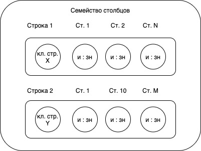

# Photo 1

(поменять местами фото 1 и 2)
Пространство ключей (аналог БД), содержится в семействе (?) стобцов для ПО

```sql
CREATE KEYSPACE ПК
use ПК
CREATE COLUMN family Pers
WITH (параметр) comparator = UTF-8 Type
    AND key_validation_class = UTF-8 Type
    AND column_metadata = [{
        column_name: fio,
        validation_class: UTF-8 Type,
        index_type: keys }, // для поиска
        {},
        {},
    }]
```

Через клиента БД:

```sql
set Pers['id']['fio'] = 'значение';

set Pers['id']['fio'] with ttl = 'N сек'; // после N сек удаляется
```

`запись данных (чтение по столбцам, а не всю строку). При записи упорядочивается по именам столбцов. Чтение эффективно по столбцам, а не по строкам`

```sql
get Pers['id'];

get Pers where fio = '';
```

```
del Pers['id']['fio'];
del Pers['id'];
```

## CQL

```sql
create columnfamily Pers
(
    key varchar primary key,
    fio varcahr,
    ...
);

insert into Pers(key, fio, ...) values ('', '', ...);

select * from Pers where fio = '';
```

(после create index)
```sql
update Pers set age = age + 1 where key = '';
```

По умолчанию имя столбца индексируется (поиск) только по ключу строки или надо явно указать индекс, тогда возможен поиск по значениям индексов (битовые индексы, которые эффективны при небольшом количестве столбцов)

# Photo 2


## Семейство столбцов

Cassandra, HBase, Amazon SimpleDB, Amazon DinamoDB, HyperTable

Сервер - кластер

БД - пространство ключей

Таблица - семейство столбцов
Столбец - столбец

Семейство столбцов:

`строка: id || имя:значение |`


- `и : зн` - имя:значение
- `Ст. N` - столбец N
- `кл. стр. X` - классификатор(?) строки X

```sql
{
    name: " ",
    value: " ", -- базовый элемент в Cassandra
    timestamp: 123456 -- время жизни (метка времени (?)/обновления/удаления при (?) бд)
}
```

```sql
{
    {
        "id": {
            ст1: " ", -- различные наборы столбцов из любой строки
            ст2: " ", -- могут быть добавлены в процессе
            -- ...
        }
    }
    {
        "id2": {

        }
    }
}
```

### Строки
```sql
"ann":  -- ключ строки
{
    "name": "",
    "adr": "",
    "age": ""
} -- коллекция столбцов ассоциируется с ключом = строка

```


столбец добавляется/удаляется в любой момент времени

Супер-столбец = ассоциативный массив
```sql
{
    "name": "bookA",
    "value": {
        "c1": "автор",
        "c2": "название",
        "isbn": 12345,
    }
},
```

Семейство супер-столбцов
```json
{
    "name": "AB",
    "value": {
        "adr": {
            "name": "adr",
            "value": {
                "city": "_",
                "str": "_"
            }
        }
    }
}
```


# Photo 3


## Семейство столбцов 2
Применение:
1. регистрация событий
2. управление информационными блогами
3. счетчики посещений
4. сроки действия (реклама, новости)

Не используется:
1. Транзакции чтения/записи
2. агрегация (только на кластере)
3. для раннего проектирования 

увеличении цены при изменении схемы, уменьшение цены изменения запросов
(изменение шаблонов запросов = изменение схемы БД)

## Согласованность

Запись -> Ш1. журнал закрепления (?) (жесткий диск) -> Ш2. таблица в памяти (оперативная память) -> запись в строку на SSTable, перезаписи нет (создание записи, очистка, удаление, и т.д)

Ш1 позволяет восстановить данные при сбое

Выполнение Ш1 и Ш2 означает правильную запись

### Уровни согласованности

При создании пространства ключей 
`W = 2, N = 3, R = 2`

(2 = уровню согласованности чтения и записи)

```
W > N / 2
(W + R) > N
```

1. Уровень чтения One

Может быть чтение с 1й реплики (старые данные), потом читение с исправлением

\+ быстро
\- устаревшие данные

2. Quorum

Чтение большинства (нов. вр. (?) / чтение с исправлением)
Запись большинства (=> подтвержденная запись)

3. ALL

\- блокируется при отказе узлов

и чтение и запись на все узлы

# Photo 4


Различные уровни согласованности различные у одного ПО (по операциям/столбцам)

Восстановление узла или столбца
```sql
repair Pers
repair Pers fio
```

Проверяется по всем репликам (очень затратно)

Узел вышел из строя:
предварительно отправил свои действие, "направления отправки", обработка отправленных имзмений

\- Атомарный уровень строки
\- Внешние транзакции черезе zookeeper

### Доступность
- одноранговая репликация

доступность, согласованность (R, W при фиксированном N)

1) 10 узлов, N = 3, R = 2, W = 2
    если 1 узел сбой, то действие получит от другого

2) R = 1, W = 2
    если 2 узла сбой, то нет записи, но есть чтение

3) R = 2, W = 1
    если 2 узла сбой, то есть запись, но нет чтение

(R + 2) > N => выбор согласованности/доступности

### Масштабирование
горизонтальное - добавление узлов, без остановки кластера

увеличение емкости
увеличение количества операций чтения/записи
