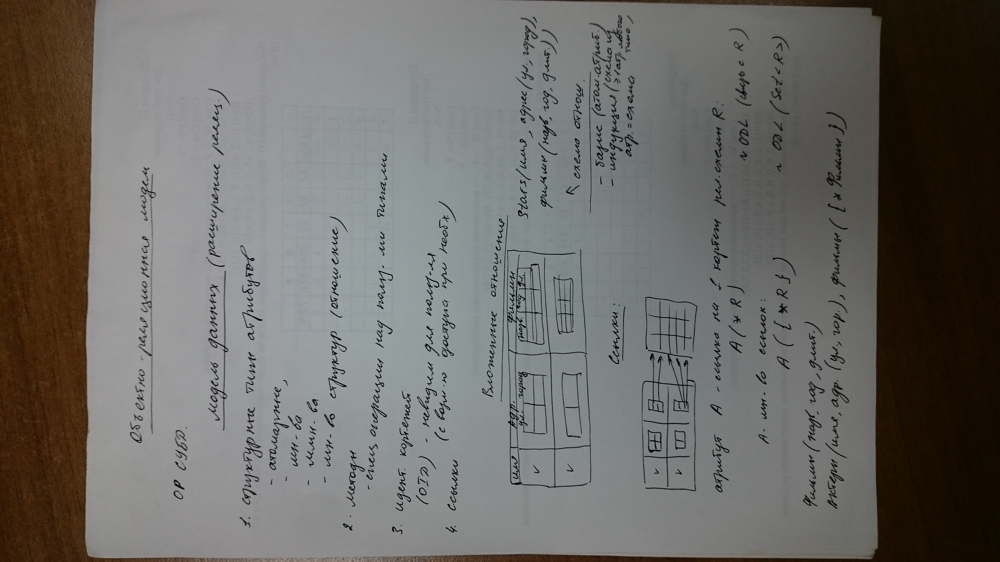
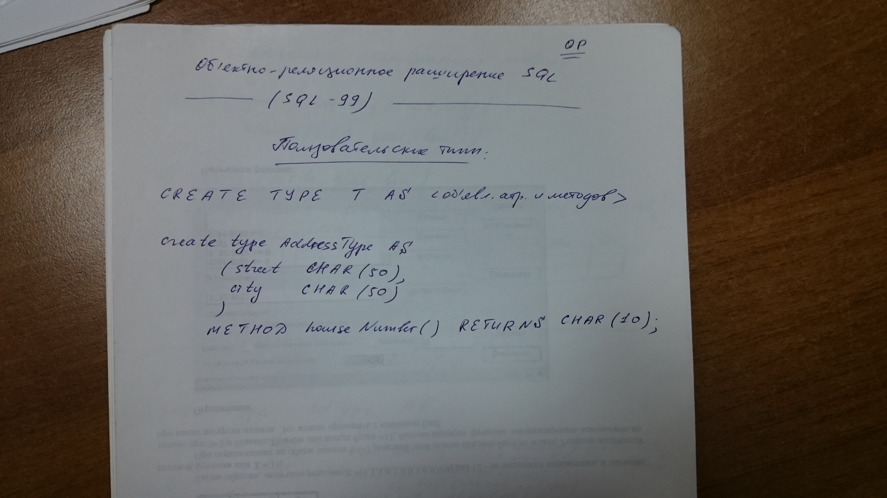

# фоточка 1 (Операции над OPD 3)


## 4. Метод-генератор
1. Создается системой автоматически
2. Наследует имя UDT, которому принадлежит и не имеет параметров
3. Можно вызывать вне контекста любого объекта
4. Возвращает пустой объект соответствующего типа без инициализации его компонентов
	T - пользовательский тип

	T() - создает пустой объект типа T	

## 5.  Методы-модификаторы
1. Создаются системой автоматически
2. Для любого атрибута x типа T (UDT) существует x(v), который применяется к объекту t типа T и изменяет значение его атрибута x на v
3. Отличается от обозревателя наличием параметра
4. 
```sql
CREATE PROCEDURE InsertStar(
	IN S CHAR(50),
	IN C CHAR(20),
	IN N CHAR(30)
)
DECLARE 
	newAddr AddressType;
	newStar StarType;
BEGIN
	SET newAddr = AddressType();
	SET newStar = StarType();

	newAddr.street(S);
	newAddr.city(C);

	newStar.name(N);
	newStar.address(newAddr);

	INSERT INTO movieStar
		VALUES (newStar);
END;
```


# фоточка 2 (Операции над OPD 4)


Вызов хранимой процедуры:
```sql
CALL InsertStar ('Адрес', 'Город', 'Имя');
```

## 6. Если СУБД поддерживает создание метода-генератора с параметрами:
```sql
INSERT INTO MovieStar
    VALUES (StarType ('имя', AddressType ('Адрес', 'Город')));
```

## 7. Сопоставление объектов UDT
1. Объекты UDT нельзя сравнить по-умолчанию
2. Объекты надо сравнивать для:
	1. Удаления кортежей-дубликатов
	2. Выполнения операций сравнения в WHERE
	3. Группировки и сортировки
3. Задания принципа сопоставления, используя `CREATE ORDERING`
4. `CRATE ORDERING FOR T EQUALS ONLY BY STATS` 
	- объекты типа T будут «равны», если «равны»  значения их одноименных компонентов.
Вложенность «равенства» для сложных типов
5. `CREATE ORDERING FOR T ORDERING FULL BY RELATIVE WITH F;`
	- для объектов типа T допустимы: <, <=, >, >=, <>
	- для сравнения объектов A и B типа T нужно использовать функцию F:
	F(A, B) = 0   =>   A = B
	F(A, B) < 0   =>   A < B
	F(A, B) > 0   =>   A > B

# Фоточка 3 (Операции над OPD 5)

(Видимо потерялся 6 пункт)
7. `CREATE ORDERING FOR T EQUALS ONLY BY RELATIVE WITH F;`
	- F(A, B) = 0    =>   A = B
	- F(A, B) != 0   =>   A != B
	- только для «равенства»
8. Пример
```sql
CREATE ORDERING FOR AddressType EQUALS ONLY BY STATE;
или
CREATE ORDERING FOR AddressType ORDER FULL BY RELATIVE WITH AddrLEG;

CREATE FUNCTION AddrLEG(
	A AddressType,
	B AddressType
) RETRUNS INTEGER
IF A.city () < B.city () THEN
	RETURN (- 1)
ELSE
	IF A.city () > B.city () THEN
		RETURN (1)
ELSE
	IF A.street () < B.street () THEN
		RETURN (- 1)
ELSE
	IF A.street () = B.street () THEN
		RETURN (0)
ELSE
	RETURN (1)
END IF;
```

# Фоточка 4 (Объектно-реляционная модель)


ОР СУБД
## Модель данных (расширения реляционной)
1. Структурные типы атрибутов
	- атомарные
	- множества
	- мультимножества
	- множвество структур (отношение)
2. Методы
	- Специальные операции над пользовательскими типами
3. Идентификация корежей
	(OID) - невидимая для пользователя (с возможностью доступа при необходимости)
4. Ссылки

**Вложенные отношения**


Stars(имя, адрес(ул, город), фильмы(название, год, длительность))

Схема отношений:
	- базис (атомарные атрибуты)
	- индукция (схема из >= 1 атрибута любого типа) 
	
**Ссылки**


Атрибут А - ссылка на 1 кортеж реляционной схемы отношений R
	
	A ( *R )    ~ ODL (связь с R)
	
A - множество ссылок:
	
	A ( {*R} )  ~ ODL (Set <R>)

Фильмы (название, год, длительность)

Актеры (имя, адрес (ул, город), фильмы ({*Фильмы})

# Фоточка 5


1. ОО расширение SQL (SQL 99 и ее объектное расширение)
	- типы
	- запросы
	- создание методов и объектов
2. Логическое ОО исчисление **(?) - позже**

# Фоточка 6 (ОР)


## Объектно-реляционное расширение SQL (SQL-99)
### Пользовательские типы
```sql
CREATE TYPE T AS <объявление атрибутов и методов>
```

```sql
CREATE TYPE AddressType AS (
	struct CHAR(50),
	city   CHAR(50)
)
METHOD houseNumber() RETURNS CHAR(10);
```


# Фоточка 7 (курсор-пример)


```sql
CREATE PROCEDURE MeanVar (
    IN s char(30),
    OUT mean real,
    OUT variance real
)
DECLARE
    Not_Found CONDITION FOR SQLSTATE '02000';
DECLARE MovieCursor (*) CURSOR FOR
    SELECT
        length
    FROM
        Movie
    WHERE
        studioName = s; (**)
DECLARE newLen INTEGER;
DECLARE movieCount INTEGER;
BEGIN
	SET mean = 0.0;
	SET variance = 0.0;
	SET movieCount = 0;
	ml: LOOP
		FETCH MovieCursor INTO newLen; -- мб список a, b, c
		IF Not_Found THEN 
			LEAVE ml 
		END IF;
		SET movieCount = movieCount + 1;
		SET mean = mean + newLen;
		SET variance = variance + newLen * newLen;
	END LOOP;
	SET mean = mean / movieCount;
	SET variance = variance / movieCount - mean * mean;
	CLOSE MovieCursor;
END;
```

\* может быть INSENSITIVE - нечувствителен к изменениям в БД
\*\* может быть FOR READ ONLY
\* может быть SCROLL, тогда NEXT | PRIOR | FIRST | LAST | RELATIVE(±n) | ABSOLUTE(±m)

```sql
UPDATE -- or DELETE
FROM R
WHERE CURRENT OF movieCursor;
```

# Фоточка 8 (PostgreSQL)


## Perform
запросы Select/Delete/Update
Выполняет и отбрасывает результат
```sql
PERFORM SELECT ... INTO ...
```

## Вызов исключение
```sql
SELECT ...
IF NOT FOUND THEN
	RAISE EXCEPTION 'сообщение об ошибке'
END IF;
```

## Перехват исключений
```sql
BEGIN
	SELECT * INTO a FROM ... WHERE ...;
	EXCEPTION
		WHEN no_data_found THEN 
			...;
		WHEN too_many_rows THEN 
			...;
END;
```

## Динамический запрос
```sql
EXECUTE строка [INTO ...] [USING ...]
$1, $1 - только для значений
```
