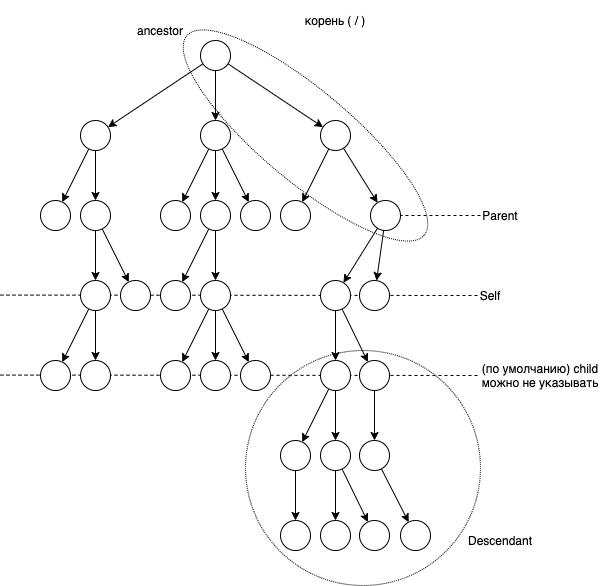

# Фоточка 1 (XPath)


XPath (XML Path Language) - язык запросов к элементам XML документа
Разработан W3C:
* Навигация по DOM в XML
* используется в XSLT
* весрия 1.0 - _, 2.0 - 2007г

Последняя поддерживаемая версия в браузерах и открытых библиотеках  - 1.0

## Основы XPath
```xml
<?xml version="1.0" standalone="yes/no"?>
<!DOCTYPE root [...]>
<root>
   <fs>
      <f fid="f1">
         <t>...</t>
         <r too="a1">
            <l>...</l>
         </r>
      </f>
   </fs>
   ...
</root>
```



## Оси
* ancestor  - предки
* parent - родитель
* self - сам элемент
* child - дети (потомок)
* descendant - потомки

* anscestor-or-self
* descedant-or-self
* attribute - атрибут (@имя)
* namespace - элемент с пространством имен (с атрибутом xmlns)
* following - элементы после текущего по тексту документа кроме его потомков
* following-sibling - элементы на его уровне по тексту документа кроме его потомков
* preceding - элементы до текущего кроме его предков
* preceding-sibling - элементы на его уровне кроме его предков

# Фоточка 2 (XPath 2)

## Разбор пути
`/root/fs/f[@fid]` - краткий синтаксис
`/child::root/child::fs/child::f[attribute::fid]` - полный
Где:
- / - шаг 1
- child::root/ - шаг 2
- child::fs/ - шаг 3
- child - ось
- f - условие проверки узлов
- attribute::fid - предикат

Шаги адресации
- слева направо
- разделяются /

Шаг содержит:
* контекст - результат выполнения предыдущего шага (множество элементов) [на Ш1 ≡ корню]
* ось - (обязательно) - направление движения на шаге
* условие - (обязательно)
	* условия выбора узлов по оси
	* имена узлов (элемент, атрибут, содержание)
	* `*` - значит все узлы
* предикат - (необязательно) - фильтр или вычисляемое выражение для фильтрации множества узлов

### Примеры
- `/root` - корень
- `/root/fs` 
- `//f` - любой f
- `//f/R` - R в любом f
- `//*` - все элементы
- `/*/*/f` - f 3го уровня
- `//f[1]` - 1й f
- `//f[last()]` - последний f
- `//f[@fid]` - все f с атрибутом id
- `//f[@*]` - все f с любыми атрибутами
- `f[not(@*)]` - все f без атрибутов
- `f[(A or B) and C]` - все f, в которых вл. B или A и C
- `/*/@*` - все атрибуты всех элементов
- `//f[@fid="f1"]` - условия по значению атрибута
- `//f[count(r) > 3]` - f, имеющие >3 дочерних r
- `//f[count(*) > 3]` - f, имеющие >3 любых дочерних элементов
- `//*[start-with(name(), "a"]` - все элементы, название которых начинается с «а»
- `//b | //c` - объединение путей любого количества
- `/a[.="aa"]` - элемент а, который равен «aa»
- `//f[positiom() mod 2 = 0]` - любого 2го f
- `A//f` - f, вл. в А

# Фоточка 3 (XPath 3)


## Некоторые функции
### Множества 
* * - любое имя
* @* - любой атрибут
* [условие]
* $переменная
* /уровень дерева
* {xpath} в другом языке (?)

- `node()` - множества всех узлов в том числе текстовых (не атрибут, не корень)
- `text()` - текстовый узел, `//text()` - все текстовые узлы
- `current()` - текущий элемент
- `last()` - номер последнего элемента в множестве (в цикле)
- `position()` - номер элемента в множестве (в цикле)
- `count()` - количество элементов в множестве
- `name(мн?)` - имя первого элемента в мн
- `name()` - имя элемента
- `id("")` - объект

### Логические
Or, and, not, =, !=, <, >, <=, >=
`[count() > 10 or @ x = "..."] ` 
`[not(усл.)]`
`boolean(об) -> t/f`
`true(); false()`

### Числовые 
 +, -, *, div, mod, sum(), round(), number()

### Строковые
* `string(об)` - строка
* `string - length(стр?)` - длина
* `contains(исх, стр)` - t / f
* `substing(стр, с, кол?)` - подстрока
* `startts - with(стр исх, стр)` - t / f
* `ends - with(исх, доп)`
* `concat(s1, s2, ..)` - конкатенация
* `translate('стрА', 'Aв', 'ав')` - замена символов в 1й строке на символы из 2

### Системные 
`document(объект)` - документ

# Фоточка 4 (XQuery)


Язык запросов к XML документам
Создан W3C
v. 1.0 + XPath 2.0
SQL:2006 - встраивание xquery в sql

## Общие понятия
Последовательность = упорядоченный набор >= 0 объектов 1 уровня
Объект = узел |  атомарное значение (из типов XML schema [стр, число])
Узел:
- элемент
- атрибут
- текст
- документ
- комментарий
- пространство имен
- команда обработки

Все узлы индивидуальны, может быть имя и значение, могут быть предок и/или потомки


## Язык
1. 
- {- комментарии -}
- (?) для ключевых слов
- Чувствительный к регистру
2. Литералы: 4, 4.7, «hello», true, false
Конструктор простого типа: `date("2001-01-01")`
( ) - определяют порядок вычислений
Последовательности: 1, 2, 3 = (1, 2, 3) = ((1, 2), 3) = 1 to 3

# Фоточка 5 (XQuery 2)


~Переменные~ 
$имя
```xquery
let $a = 10, $b = 15
return $a to $b
``` 

~Вызов функций~
Имя ( парам )
```xquery
substring("hello", 1, 3) <!-- из базовой библиотеки -->
```

~Путь~ 
определяется как XPath:
- шаг1/шаг2/…/
- Рут (?) любого шага - последовательность узлов (контекст, ось, условие выбора, предикат)
- краткий и полный синтаксис осей

`document("a.xml")/root/*/ait[@aid="123"]/fio`
Встроенная функция, возвращает узел (документ)

~Сравнение идентичености узлов~:
```xquery
$n1 is $n2
$n1 is not $n2
$1 << $2 <!-- если n1 ранее в документе, чем n2 -->
```

## Конструктор элементов
1. Подстановка значений (констант) в XML-текст
2. Из существующих узлов: {$a/@id, $a/b}
3. С указанием нового элемента
`element{name($e)}{$e/@*, data($e)*2}`
($e = существующему элементу с числовым значением)
`attribute {if $p/sex="m" then "man" else "women"} {$p/fio}`
- `attribute` - встроенная функция
- `{if $p/sex="m" then "man" else "women"}` -  имя атрибута/элемента
- `{$p/fio}` - состав/значение

```xquery
element A {
	attribute id {зн},
	attribute n {зн},
	element B {зн}
}
```

# Фоточка 6 (XQuery 3)


## Итерация
```xquery
for $x in (2, 3) return $x+1 <!-- (3, 4) -->

for $x in (2, 3), $y in (5, 10)
	return {x * y} <!-- (10, 20, 15, 30) вложенный цикл -->
```

## FLWOR
```xquery
for $a in document("a.xml")/*/ait
	let $f := document("f.xml")//f[@fid = $a/@tof]
	where count($f) > 3
	order by $a/fio
	return {$a/fio, $a/adr, {count($f)}}
```

## Операции
+, -, *, div, mod, sum(), avg(), max(), min(), count()

## Условие
`if условие then ____ else ____`

## Примеры
```xquery
<wl>
	{ for $x in doc("a.xml")//t/text()
		order by $x
		return <li>{$x}</li>
		<!-- или -->
		if ($x/@at = "ABC")
		then <a1>{data($x/t2)}</a1>
		else ...
	}
</wl>
```

узел/text() -> значение. Текст. Узлы
data($узел) -> знач узла
data($атрибут)

Else - обязателен, но может быть пуст
else()

# Фоточка 7


XPath - для адресации элемента (атрибута) в XML
XQuery - генерирует последовательность узлов:
```xquery
<html>
	{
		let $a := document("a.xml")/a
		for $b in $a/b
			return <h2>{$b/c}</h2>
	}
</html>
```

# Фоточка 8 (XPath 4)


`document(xml - документ)`
`collection(набор элементов без корня)`

## Проверка узлов в пути
Ось::проверка()
* node()
* text()
* comment()
* element() - по умолчанию
* element(имя) - по умолчанию

attribute()
processing-instruction()
document-node()

## Пространства имен
`<root xmlns="http://..."` - пространство имен по умолчанию
В XQuery:
1.  `declare namespace c = "http://....";`
 `doc(файл)//c:тэг/c:тэг2`

2. `declare default element namespace "http://..."`
`doc(файл//тэг/тэг2`

## Базовый набор
Множество функций и операторов по типам (дата/время, строки, логические)

## Предикаты
…[2]
…[ last()-1 ]
//a[ b[ empty(c) ] ]

# Фоточка 9 (XPath 5)

## Примеры
```xml
for $i in ...//@*
return <p>{$i}</p> <!-- => <p id="..."></p> -->
```

### Внедрение
`<abc> { sum(1, 2, 3) } </abc>`
{ sum(1, 2, 3) } - XPath

### Функции
```xquery
declare function nu: назв(($a as element(назв)*)
as element(назв)*
{
	for...
	to here ... = $a/...
	return ...
}
...
return nu:назв(параметр)
```

```xquery
declare function пр.имен:fun($a as xs:decimal?, ...)
	as xs:decimal <!-- тип  as element(my: A)-->
{
	let $c = $a + $b <!-- return <My:A id={}> </My:A> -->
	return $c
}
;

<A> {пр. имен: fun($x/book, ...)} </A> <!-- вызов -->
```

### Типы
- узлы (смотри условия выбора)
- тип (xs: double, my: тип)

```
тип ? , _, +, *
	 1≥0 =1  ≥1 ≥0
```

xs:
- float
- integer
- string
- date

`element(), element(назв)`
`attribute(), attribute(*, тип)`
`node()`

# Фоточка 10 (от ODL к реляционным схемам)


## 1. Цель
объектный проект, практическая реализация - РБД

nEr -> реляция (?)

## 2. Особенности
1. Для реляционных необходим ключ;
В ODL есть OID => нет необходимости в ключевых атрибутах
2. ER и реляц. -> атомарные атрибуты
ODL - атрибуты => атомарные реляционные атрибуты
(Коллекции).        |
	нелинейной преобразование
	ненормализованное отношение
	преобразования
3. ODL - методы -> 1 реляционных методов нет

## 3. ODL-атрибут -> атрибут отношений
1 класс -> 1 отношение
1 атрибут -> 1 атрибут
ЕСЛИ
1. Все свойства классов = атрибуты (не свойства, не метод)
2. Типы всех свойств атомарные

```
{
	a_ string title;
	a_ integer year;
	a_ enum Film(color, bw) fType;
}
```
Следовательно Movies(title, year, fType) - схема отношений
1 объект Movies -> 1 кортеж Movies

# Фоточка 11 (от ODL к реляционным схемам 2)


## 4. Неатомарные атрибуты класса
1. Структура -> разбиение на поля (переименование одноименных полей в различных структурах)

```
class Star(extend Stars) {
	a struct Addr(string ул, string город) address;
	a_ string name;
};
=> Stars(ул, город, имя)
		   атомарные типы
```

2. Множества Set
```
class Star(extend Stars) {
	a_ string name;
	a_ set<struct Addr{string ул, string город}> address;
};
=> Stars(name, ул., город)
```
|n1|ул1|город1|
|n1|ул2|город2|
|n2|ул3|город3|

Нарушения BCNF, Если кроме name есть другие атрибуты (дата рождения)
(Дублирование данных; аномалия удаления (нет актеров без дома))
Тк ключ не name, а name, ул, город
Следовательно необходима дальнейшая нормализация

3. Вад
Тк кортежи не могут дублироваться => поля + доп. поле (количество повторов)

4. List
+ доп. Поле (позиция от 1)

# Фоточка 12 (от ODL к реляционным схемам 3)

5. Array
Дополнительные поля, по 1 на любой элемент массива
|name|str1|str2|str3|
|----|----|----|----|
|    |    |    |    |

6. Dictionary

|name|ключ|значение|
|----|----|--------|
|    |    |        |

## 4. Связи
1. Связь М:М
Дополнительное отношение, содержащее ключи сущностей
2. Связь 1:М
(Ключ. Поле FK на стороне многих)
3. Если в ODL не было ключевых атрибутов, то
Добавить доп поле (~OID) для идентификации

# Фоточка 13 (Сравнение ОО и ОР БД)

1. Объекты и кортежи

    ODL:
    ```
    объект = структура (атрибут +связи)
    не определяется что есть связь
    ```

    Реляц:
    ```
    кортеж = структура (атрибут)
    связь = кортеж другого отношения
    ```

    ОР:
    ```
    атрибут может быть ссылкой
    ```

2. Экземпляры классов и отношения
    ODL:
    ```
	все объект принадлежат экстенту
	интерфейсы (без существующих экстентов)
	N классов наследующих интерфейс
    ```

    ОР:
    ```
	N отношений с одной схемой
    ```
3. Методы
В SQL 99 средства объявления и описания методов в составе классов
4. Системные типы
    Похожи:
    ```
	атомарности + структуры + коллекции (set, bag), остальные зависит от реализации
    ```
    Множество структур:
    ```
	ODL -> класс
	OP -> отношение
    ```
5. Ссылки и OID
    ODL:
    ```
	любой объект имеет уникальный OID (скрыт, нет чт.)
    ```
    ОР:
    ```
	ссылка может быть просмотрена (изменена?)
    ```
6. Обратная совместимость
	подд-ся в об-релляционной БД (может использовать реляционную схему)

# Фоточка 14 (SQL в среде программирования)


## I
1. Базовый интерфейс SQL
Специальный интерпретатор SQL для СУБД
2. Внедрение SQL в среду программирования
3. Вызов функций доступа к SQL

## II
Базовый язык -> целые, действительные, указатели и т.д. Нет множеств
SQL -> реляционная модель, таблица данных, нет циклов, ветвлений
Различные задачи = различные средства


## III
1. Общие переменные
    ```
    Достув (?) в языках программирования и SQL
    Из программирования -> var
    SQL -> :var
    ```
2. Специальные переменные (из стандартов SQL)
    ```
    SQLSTATE - 5 символов
    Код, результат выполнения по следующий функции
    ‘00000’ = OK
    ‘02000’ = Нет кортежей
    И тд
    ```

# Фоточка 15 (Внедрение SQL 2)


```sql
EXEC SQL BEGIN DECLARE SECTION;
	char shaml[31], sAdr[256];
	char SQLSTATE[6];
	int pres;
EXEC SQL -- внедрение SQL
END DECLARE SECTION;
-- работа с sName, sAdr
EXEC SQL 
INSERT INTO studio(name, addr)
	VALUES(:sName, :sAddr);
EXEC SQL 
SELECT netW INTO :pres
	FROM studio
	WHERE studio.name = :sName;
-- анализ SQLSTATE
```

Внедрение:
1. Команды SQL, не возвращают множество
    `-` insert, update, delete
    `+` изменения схемы БД
2. Возвращает 1 кортеж в переменной (1 для любого поля)
3. Для возврата множества записей используются курсоры

```sql
EXEC SQL DECLATRE eCur CURSOSR FOR
	SELECT netW FROM movieExec;

EXEC SQL OPEN eCur;
WHILE(1) {
	EXEC SQL FETCH FROM eCur INTO :pres
	IF(!strcmp(SQLSTATE, '02000')) BREAK;
		arr[i] = pres;
}
EXEC SQL CLOSE eCur;
```

# Фоточка 16 (Внедрение SQL 3)


Если курсор для базовой таблицы, то можно вносить изменения. 
В цикле добавить…
```sql
IF (pres > 10)
	EXEC SQL DELETE FROM MovieExec -- базовая таблица курсора
		WHERE CURRENT OF eCur;
ELSE
	EXEC SQL UPDATE MovieExec
		SET netW = 2 * netW;
```

Объявление курсора для базовой таблицу:
```sql
EXEC SQL DECLARE eCur -- название курсора
CURSOR FOR MovieExec; -- название таблицы
```

## Типы курсоров
1. (?)
    ```sql
    EXEC SQL DECLARE eC INSENSITIVE /* нечувствительны к //-м изменениям (необходимо упр. сист.) */ CURSOR FOR
        SELECT ... FOR READONLY;
    ```
2. 
    ```sql
    EXEC SQL DECLARE eX SCROLL /* листаемый (?) */ CURSOR FOR ...
    ```

    ```sql
    EXEC SQL FETCH $A FROM курсор INTO ...;
    ```
    $A:
    - first last
    - next prior
    - relative(n) ±N
    - absolute(n)

# Фоточка 17 (Внедрение SQL 4)


Динамический SQL
1. 
```sql
EXEC SQL PREPARE SQLQuery FROM :query;
-- SQLQuery - переменные SQL
-- :query - общая переменная char XQuery, содержит запрос SQL
EXEC SQL EXECUTE SQLQeury;
```

2. 
```sql
EXEC SQL EXECUTE IMMEDIATE :query;
-- без препроцессора
```

## Cache
Встроенный SQL 
```
&SQL (SELECT a INTO :a FROM TAB WHERE b = :b)
```

### Курсор
```sql
&SQL(DECLARE cur CURSOR FOR 
	SELECT a, b INTO :a, :b)

&SQL(Open cur)
FOR {
	&SQL(FETCH cur)
	IF SQLCODE
		QUIT
	WRITE a, b
}
&SQL(CLOSE cur)
```
