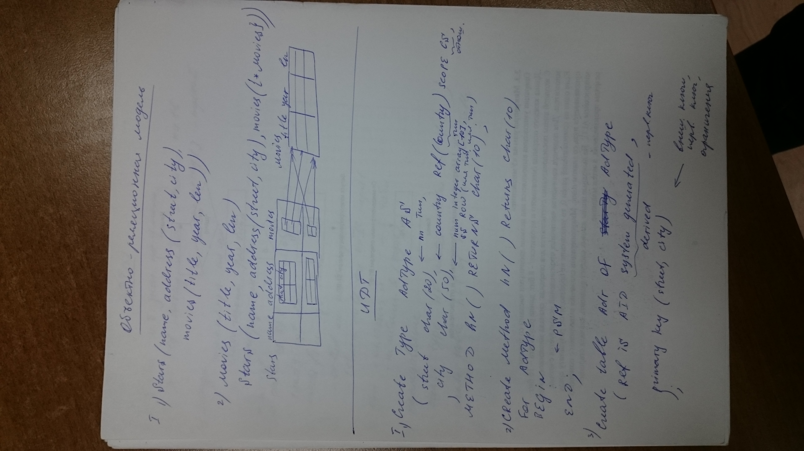
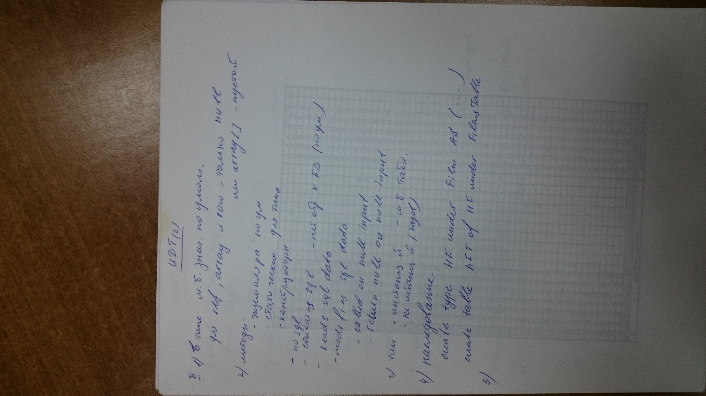

# UDT
# Фоточка 1 (SQL-1999: UDT)


6. Таблицы типизированные
```sql
CREATE TABLE название OF UDT-тип
[UNDER базовая таблица]
[(
	[ограничения,] -- PK, UNOQUE, NOT NULL только для базовых
	[столбец WITH OPTIONS SCOPE t1 | DEFAULT '_' | CHECK(), ] -- только для нов. столб.
	REF IS NONE SYSTEM GENERATED | USER GENERATED | DERIVED -- обязательно и только для базовой таблицы
)];
```

7. Ссылки
Ссылки создаются, не изменяются
```sql
... SCOPE TABLE REFERENCES ARE [NOT] CHUNCKED [ON DELETE ...] 
```

8. Запросы
```sql
SELECT a -> b, Deref -- Deref - (поле cc)
FROM S -- для S и подтипов S
ONLY S -- только из S
```
Для INSERT, DELETE, UPDATE аналогично

INSERT - вставляет в указанную таблицу

# Фоточка 2 (SQL-1999: UDT)


1. Индивидуальный тип
```sql
CREATE TYPE T -- название
AS INTEGER -- стандартный тип
FINAL; -- обязательно
```

Сравнивать можно только элементы 1 типа !!

2. Структурный тип
```sql
CREATE TYPE Название
[UNDER базовый тип]
AS тип | (атрибут тип [SCOPE ...] [DEFAULT X], ...)
[ [NOT] INSTANTIABLE ]
[NOT] FINAL -- обязательно для структурных типов
[
	REF IS SYSTEM GENERATED -- по умолчанию
	| REF USING тип -- созд. прилож
	| REF USING (атр 1, атр. N) -- на основе атрибутов
]
[cast ...]
список методов;
```

3. Методы
* [OVERRIDING]
* [INSTANCE | STATIC | CONSTRUCTOR]
`METHOD название (атрибут тип, атрибут тип) RETURNS тип` 
* [self AS result]
* [self AS locator]
* [parameter style sql | java | …]
* [ [NOT] deterministic ]
* [NO SQL | CONTAINS SQL | reads sql data | modifies sql data]
* [return NULL on NULL input | called on NULL input]

# Фоточка 3 (Объектно-реляционная модель)


1. 
	1. `Stars(name, address(street, city), movies(title, year, len))`
	2. `movies(title, year, len)`
	`Stars(name, address(street, city), movies({*movies}))`
	
(Добавить рисунок)

## UDT
1. Пункт 1
	1. 
    ```sql
    CREATE TYPE AdType AS (
        -- пп Тип,
        street CHAR(20),
        -- country Ref(Country) SCOPE CS, -- Country - тип, CS - отношение
        city CHAR(50),
        -- num INTEGER ARRAY[10],
        -- SS ROW(имя тип, имя тип)
    )
    METHOD hN() RETURNS char(10);
    ```

	2. 
    ```sql
    CREATE METHOD hN() RETURNS CHAR(10)
    FOR AdType
    BEGIN
        -- PSM
    END;
    ```

	3. 
    ```sql
    CREATE TABLE Adr OF AdType (
        Ref IS AID system generated, -- derived
        PRIMARY KEY (street, city) -- внешний ключ, первичный ключ, ограничения
    )
    ```

# Фоточка 4 (UDT 2)


2. Пункт 2
	1. В типе может быть значение по умолчанию для ref, array и row - только null или array[] - пустой
	2. Методы
		* экземпляра по умолчания
		* статические для типа
		* конструкторы

		* no sql
		* contains sql - нет обращения к БД (по умолчанию)
		* reads sql data
		* modifies sql data
			* called on null input
			* return null on null input
	3. Тип
		* инстанцированный (может быть таблицей)
		* не инстанцированный (базовый)
	4. Наследование
    ```sql
    CREATE TYPE HF UNDER FILM AS (...);
    -- или
    CREATE TABLE HFT OF HF UNDER FilmsTable;
    ```

# Фоточка 5 (UDT 2)
3. Пункт 3
	1. 
    ```sql
    SELECT Deref(mng)
    FROM dept
    WHERE dept->title = '...';
    ```
    2. 
    ```sql
    SELECT m.year()
    FROM movie m
    WHERE m.title() = '...';
    ```
	3. 
    ```sql
    DECLATE na AdType;
    SET na = AdType();
    na.city = '...'
    INSERT INTO Adr VALUES (na);
    ```
	4. Delete, update, insert, select
	5. Only 
    ```sql
    SELECT name
    FROM only(emp); -- если есть без производных
    ```

4. Пункт 4
	1. `CREATE ORDERING FOR тип EQUALS ONLY BY STATE;`
	2. `CREATE ORDERING FOR тип ORDER FULL BY RELATIVE WITH f;`
		1. f(a, b) = 0, ≠0
		2. f(a, b) > 0, a > b
		           = 0, a = b
			   < 0, a < b
# Фоточка 6 (Синтаксис объявления UDT)

PS. Ниже представлен блок в формате КОД -> Описание

```sql
CREATE TYPE тип AS
```

```sql
[UNDER базовый тип]
```
* только для структурного типа, базовый тип = максимальный

```sql
[AS (
	атрибут тип,
	атрибут тип DEFAULT 'значение',
	...
)]
```

* для базовых типов обязательно
* для производных типов может отсутствовать
* если = атом. тип, то это индивидуальный тип
* Ограничения всегда в описании таблиц, а не тип

```sql
[INSTANTIABLE | NOT INSTANTIABLE]
```
- существует конструктор => существует значение

```sql
[NOT] final
```
- переопределение

```sql
[REF IS SYSTEM GENERATED | REF USING атом. тип | REF USING список атрибутов]
```
Только в базовом типе:
* генерируется автоматически
* генерируется приложение с использованием атомарного типа
* на основе значения атрибутов (наследуется производными типами)

```sql
[CAST (source AS REF) WITH f1 | CAST (REF AS source) WITH f2]
```	
* Функции преобразует число в ссылку (и наоборот)
* генерируется системой автоматически
* f1 и f2 - именно для использования в приложении

```sql
[описание методов];
```
	 
## Таблицы
```sql
CREATE TABLE имя OF тип 
[UNDER базовая таблица]
[REF IS атрибут SYSTEM GENERATED | USER GENERATED | DERIVER] -- для базовых таблиц
[новый атрибут WITH OPTIONS SCOPE таблица | DEFAULT 'значение' | ограничение на значение]
```

Экстент производного типа ⊆ эксетент базового

Наследование типа ≈ наследование таблицы

Ограничение целостности для нового атрибута (первичных и уникальных - для базовой таблицы)

# Фоточка 7 (описание методов UDT)
```sql
[overriding] -- перегрузка
instance | -- экземпляр
static | -- статический экземпляр
constuctor -- конструктор
method

имя ([имя тип, имя тип, ...]) RETURNS тип
[specific доп_имя метода] -- для обращения при перегрузке
[self as result]
[self as locator]
[
	язык | 
	стиль параметров | -- parameter style sql/java
	[not] determenistic | -- const при const параметрах
	no sql / contains sql / reads sql data / modifies sql data |
	return null on null input / called on null input
]
```


Исходный метод:
1. Экземпляра
2. Cтатические
3. Конструкторы

Для неистанцированного типа только статические методы

Ссылки задаются 2 раз и не меняются.

Проверка целостности

Действия каскадом

`scope табл references are [not] checked [on delete действие]`

`create view имя of тип under табл (атрибут) as запрос`
